# WAM Knowledge Graph — Pivot Analysis

> **37 papers mapped across 7 research clusters. 5 pivot papers identified.**

---

## 🎯 Pivot Papers (5)

| Pivot | arXiv | Role | Why Pivot? |
|-------|-------|------|------------|
| **I-JEPA** | [2301.08243](https://arxiv.org/abs/2301.08243) | JEPA Blueprint | Defines the Encoder→Predictor→Target architecture. ALL 20+ JEPA papers descend from this. |
| **V-JEPA 2** | [2506.09985](https://arxiv.org/abs/2506.09985) | Video JEPA Hub | Establishes understanding+prediction+planning triad. Connects JEPA to world models. |
| **MC-JEPA** | [2307.12698](https://arxiv.org/abs/2307.12698) | Multimodal Pioneer | First video JEPA. Motion-content factorization blueprint for all video variants. |
| **LeWorldModel** | [2603.19312](https://arxiv.org/abs/2603.19312) | Full WAM Bridge | First end-to-end JEPA world model from pixels. Bridges SSL and MBRL. |
| **DayDreamer** | [2206.14176](https://arxiv.org/abs/2206.14176) | Real-World Proof | First deployment of learned world models on physical robots. Validates the vision empirically. |

---

## 🗺 Knowledge Graph

```mermaid
graph TB
    subgraph FOUNDATION["🏛 Philosophical Foundation"]
        LECUN["LeCun 2022<br/>Path Towards Autonomous<br/>Machine Intelligence"]
    end

    subgraph PIVOT_JEPA["🔴 PIVOT: I-JEPA (2301.08243)"]
        IJEPA["I-JEPA<br/>Context→Target→Predictor<br/>Canonical JEPA architecture"]
    end

    subgraph PIVOT_MC["🔴 PIVOT: MC-JEPA (2307.12698)"]
        MCJEPA["MC-JEPA<br/>Motion + Content<br/>First video JEPA"]
    end

    subgraph PIVOT_VJEPA["🔴 PIVOT: V-JEPA 2 (2506.09985)"]
        VJEPA2["V-JEPA 2<br/>Understanding + Prediction<br/>+ Planning triad"]
    end

    subgraph PIVOT_LEWM["🔴 PIVOT: LeWorldModel (2603.19312)"]
        LEWM["LeWorldModel<br/>End-to-end JEPA<br/>from pixels"]
    end

    subgraph PIVOT_DAY["🔴 PIVOT: DayDreamer (2206.14176)"]
        DAY["DayDreamer<br/>Real-robot world model<br/>First deployment"]
    end

    %% Theory cluster
    subgraph CLUSTER_THEORY["📐 Cluster A: JEPA Theory (6 papers)"]
        SIAM["SiamJEPA<br/>2607.04044"]
        GAUSS["Gaussian Embeddings<br/>2510.05949"]
        CONTRAST["JEPA↔Contrastive<br/>2410.19560"]
        LEJEPA["When Does LeJEPA<br/>Learn? 2605.26379"]
        SUB["Sub-JEPA<br/>2605.09241"]
        PROBE["Probing Latent World<br/>2603.20327"]
    end

    %% Video cluster
    subgraph CLUSTER_VIDEO["🎬 Cluster B: Video JEPA (6 papers)"]
        VJEPA21["V-JEPA 2.1<br/>2603.14482"]
        RETHINK["Rethinking JEPA<br/>2509.24317"]
        DRIVE["Drive-JEPA<br/>2601.22032"]
        JEPAVLA["JEPA-VLA<br/>2602.11832"]
        SKY["SkyJEPA<br/>2606.23444"]
        DSEQ["DSeq-JEPA<br/>2511.17354"]
    end

    %% World Model cluster
    subgraph CLUSTER_WM["🤖 Cluster C: World Models / Dreamer (6 papers)"]
        TDREAM["TransDreamer<br/>2202.09481"]
        DCDP["Dreamer-CDP<br/>2603.07083"]
        SAFE["SafeDreamer<br/>2307.07176"]
        PROBDREAM["Probabilistic Dreaming<br/>2603.04715"]
        MANYWORLDS["Dreaming of Many Worlds<br/>2403.10967"]
        STABLE["stable-worldmodel<br/>2605.21800"]
    end

    %% Modality cluster
    subgraph CLUSTER_MODAL["🔊 Cluster D: Modality Extensions (5 papers)"]
        AJEPA["A-JEPA (Audio)<br/>2311.15830"]
        SJEPA["S-JEPA (Speech)<br/>2606.19398"]
        POINT["Point-JEPA (3D)<br/>2404.16432"]
        TEXT["Text-Conditional JEPA<br/>2605.03245"]
        CNN["CNN-JEPA<br/>2408.07514"]
    end

    %% Planning cluster
    subgraph CLUSTER_PLAN["🧠 Cluster E: Planning & Hierarchy (4 papers)"]
        HIER["Hierarchical Planning<br/>2604.03208"]
        DILA["DiLA<br/>2605.15725"]
        UWM["UWM-JEPA<br/>2605.25313"]
        ADA["AdaJEPA<br/>2606.32026"]
    end

    %% Critique cluster
    subgraph CLUSTER_CRITIQUE["⚡ Cluster F: Critique & Alternatives (5 papers)"]
        GAIA["GAIA-1<br/>2309.17080"]
        SORA1["Sora as World Model?<br/>2403.05131"]
        SORA2["Is Sora a Simulator?<br/>2405.03520"]
        PHIL["Sora/V-JEPA Critique<br/>2407.10311"]
        TEMP["Temporal Differences<br/>2606.15956"]
    end

    %% EDGES: Foundation → Pivots
    LECUN --> IJEPA
    LECUN --> DAY

    %% I-JEPA → all JEPA variants
    IJEPA --> MCJEPA
    IJEPA --> SIAM
    IJEPA --> GAUSS
    IJEPA --> CONTRAST
    IJEPA --> LEJEPA
    IJEPA --> SUB
    IJEPA --> AJEPA
    IJEPA --> CNN
    IJEPA --> DSEQ

    %% MC-JEPA → Video JEPA
    MCJEPA --> VJEPA2
    IJEPA --> VJEPA2

    %% V-JEPA 2 → video extensions + embodied
    VJEPA2 --> VJEPA21
    VJEPA2 --> RETHINK
    VJEPA2 --> DRIVE
    VJEPA2 --> JEPAVLA
    VJEPA2 --> SKY
    VJEPA2 --> PROBE

    %% LeWorldModel bridges JEPA + World Models
    IJEPA --> LEWM
    VJEPA2 --> LEWM
    LEWM --> HIER
    LEWM --> DILA
    LEWM --> UWM
    LEWM --> ADA

    %% DayDreamer → Dreamer ecosystem
    DAY --> TDREAM
    DAY --> DCDP
    DAY --> SAFE
    DAY --> PROBDREAM
    DAY --> MANYWORLDS
    DAY --> STABLE

    %% Cross-cluster bridges
    SJEPA --> AJEPA
    TEXT --> JEPAVLA
    POINT --> SKY
    DCDP -.->|convergence| LEWM
    GAIA -.->|counterpoint| DRIVE
    PHIL -.->|critiques| VJEPA2
    SORA1 -.->|defines bar| LEWM

    %% Styling
    classDef pivot fill:#e03131,color:#fff,stroke:#c92a2a,stroke-width:3px
    classDef foundation fill:#5c3d99,color:#fff,stroke:#4a2d7a,stroke-width:2px
    classDef cluster fill:#2b2d42,color:#8d99ae,stroke:#4a4d6b
    
    class IJEPA,MCJEPA,VJEPA2,LEWM,DAY pivot
    class LECUN foundation
```



---

## 📊 Cluster Analysis

### Cluster A: JEPA Theory (6 papers)
**Pivot: I-JEPA (2301.08243)**

| Paper | Role | Relationship to Pivot |
|-------|------|----------------------|
| SiamJEPA (2607.04044) | Architectural validation | Tests whether asymmetric encoders are necessary |
| Gaussian Embeddings (2510.05949) | Theoretical insight | Reveals JEPA implicitly learns data density |
| Connecting JEPA↔Contrastive (2410.19560) | Paradigm unification | Shows JEPA as a form of contrastive learning |
| When Does LeJEPA Learn? (2605.26379) | Capability audit | Determines conditions for emergent world model behavior |
| Sub-JEPA (2605.09241) | Training stability | Principled solution to representation collapse |
| Probing Latent World (2603.20327) | Interpretability | Tests whether latent spaces develop symbolic structure |

**Key insight**: This cluster validates and strengthens I-JEPA's foundations. Without these papers, JEPA remains an empirical trick rather than a principled architecture.

---

### Cluster B: Video JEPA (6 papers)
**Pivot: MC-JEPA (2307.12698) → V-JEPA 2 (2506.09985)** (two-tier pivot)

| Paper | Role | Relationship to Pivot |
|-------|------|----------------------|
| V-JEPA 2.1 (2603.14482) | Dense features | Upgrades from sparse→dense representations |
| Rethinking JEPA (2509.24317) | Efficiency | Frozen teacher reduces training cost ~40% |
| Drive-JEPA (2601.22032) | Application | Video JEPA for autonomous driving trajectory prediction |
| JEPA-VLA (2602.11832) | Application | Video JEPA as necessary component for robot VLA models |
| SkyJEPA (2606.23444) | Application | Video JEPA for zero-shot quadrotor sim-to-real |
| DSeq-JEPA (2511.17354) | Architectural variant | Sequential JEPA with discriminative (energy-based) objective |

**Key insight**: This is the most APPLICATION-DENSE cluster. V-JEPA 2's understanding+prediction+planning triad makes it the bridge between pure SSL and deployed world models.

---

### Cluster C: World Models / Dreamer (6 papers)
**Pivot: DayDreamer (2206.14176)**

| Paper | Role | Relationship to Pivot |
|-------|------|----------------------|
| TransDreamer (2202.09481) | Architecture upgrade | Replaces Dreamer's RNN with transformer |
| Dreamer-CDP (2603.07083) | Convergence toward JEPA | Eliminates reconstruction loss, moving toward JEPA-style |
| SafeDreamer (2307.07176) | Safety | Adds constrained planning to Dreamer |
| Probabilistic Dreaming (2603.04715) | Uncertainty | Bayesian world model predictions |
| Dreaming of Many Worlds (2403.10967) | Generalization | Zero-shot transfer across environments |
| stable-worldmodel (2605.21800) | Infrastructure | Standardized benchmark for world model research |

**Key insight**: This cluster is undergoing a **CONVERGENCE** toward JEPA principles (Dreamer-CDP removes reconstruction). The Dreamer and JEPA lineages are merging.

---

### Cluster D: Modality Extensions (5 papers)
**Pivot: I-JEPA (2301.08243)** (shared with Cluster A)

| Paper | Modality | Innovation |
|-------|----------|------------|
| A-JEPA (2311.15830) | Audio | First non-vision JEPA. Proves generality. |
| S-JEPA (2606.19398) | Speech | Soft clustering targets for speech SSL |
| Point-JEPA (2404.16432) | 3D Point Clouds | JEPA for irregular spatial data |
| Text-Conditional JEPA (2605.03245) | Vision+Language | Language-grounded visual JEPA |
| CNN-JEPA (2408.07514) | Efficient Vision | JEPA for CNN backbones (edge deployment) |

**Key insight**: This cluster validates JEPA's claim of **MODALITY AGNOSTICISM**. If JEPA only worked for ViT on ImageNet, it would be a trick. Working across audio, speech, 3D, and CNNs proves it's a general principle.

---

### Cluster E: Planning & Hierarchy (4 papers)
**Pivot: LeWorldModel (2603.19312)** + **LeCun's Vision Paper**

| Paper | Role | What it adds |
|-------|------|-------------|
| Hierarchical Planning (2604.03208) | Multi-level planning | Two-level latent-space planner (≡ LeCun's configurator) |
| DiLA (2605.15725) | Factorized actions | Disentangles action space into independent components |
| UWM-JEPA (2605.25313) | Partial observability | JEPA in belief space for POMDP environments |
| AdaJEPA (2606.32026) | Adaptive capacity | Test-time adaptation for distribution shift |

**Key insight**: This is the **MOST LE-CUN-ALIGNED** cluster. These four papers directly implement different modules from LeCun's architecture diagram: hierarchical planning, modular action, uncertainty handling, and adaptive computation.

---

### Cluster F: Critique & Alternatives (5 papers)

| Paper | Stance | Relationship to JEPA |
|-------|--------|---------------------|
| GAIA-1 (2309.17080) | Generative alternative | Pixel-space world model for driving. Tests LeCun's claim that generation is unnecessary. |
| Sora as World Model? (2403.05131) | Critical survey | Evaluates video diffusion as world models. Mostly negative. |
| Is Sora a Simulator? (2405.03520) | Taxonomy | Provides definitional framework for what counts as a world model |
| Sora/V-JEPA Critique (2407.10311) | Philosophical challenge | Argues NEITHER Sora NOR V-JEPA are true world models |
| Temporal Differences (2606.15956) | Alternative objective | Simpler predictive signal than JEPA masking |

**Key insight**: This cluster keeps the field **HONEST**. The critiques apply equally to JEPA and generative approaches — neither has reached true world model status. This defines the research frontier.

---

## 🔗 Cross-Cluster Bridges

```
                    ┌──────────────┐
                    │  LeCun 2022  │
                    │   (Vision)   │
                    └──────┬───────┘
                           │
          ┌────────────────┼────────────────┐
          ▼                ▼                ▼
   ┌──────────┐    ┌──────────────┐  ┌──────────────┐
   │ I-JEPA   │    │ DayDreamer   │  │  Generative   │
   │ (SSL)    │    │ (MBRL)       │  │  (GAIA-1)     │
   └────┬─────┘    └──────┬───────┘  └──────┬───────┘
        │                 │                  │
        ▼                 │                  │
   ┌──────────┐           │                  │
   │ MC-JEPA  │           │                  │
   │ V-JEPA 2 │           │                  │
   └────┬─────┘           │                  │
        │                 │                  │
        ▼                 ▼                  │
   ┌──────────────────────────┐              │
   │     LeWorldModel         │◄─────────────┘
   │  (JEPA + MBRL bridge)    │   convergence
   └──────────┬───────────────┘
              │
    ┌─────────┼─────────┐
    ▼         ▼         ▼
  Hierarchical  DiLA   UWM-JEPA
  Planning    (Action) (Belief)
```

**Three forces shaping the field:**
1. **JEPA lineage** (I-JEPA → MC-JEPA → V-JEPA 2 → LeWorldModel) — the MAIN trunk
2. **Dreamer lineage** (DayDreamer → TransDreamer → Dreamer-CDP) — converging with JEPA
3. **Generative lineage** (GAIA-1, Sora) — alternative path, serves as counterpoint

The **convergence point** is LeWorldModel (2603.19312) — it takes JEPA's SSL backbone and Dreamer's MBRL framework, uniting both lineages into a single architecture.

---

## 📈 Research Timeline

```
2022 ─── LeCun Vision ─── DayDreamer ─── TransDreamer
         (foundation)     (real robot)    (transformer WM)

2023 ─── I-JEPA ─────── MC-JEPA ────── A-JEPA ────── GAIA-1 ─── SafeDreamer
         (blueprint)     (video JEPA)    (audio JEPA)   (generative) (safe WM)

2024 ─── Point-JEPA ─── CNN-JEPA ─── Contrastive──DreamMany──Sora Survey ×3
         (3D JEPA)       (efficient)    (theory)      (generalize)  (critique)

2025 ─── V-JEPA 2 ───── Rethink ───── Gaussian ──── DSeq-JEPA
         (triad)         (efficient)    (theory)       (energy-based)

2026 ─── LeWorldModel ── JEPA-VLA ── Drive-JEPA ── SkyJEPA
         (full WAM)      (robot VLA)   (driving)      (drone control)
         
         Sub-JEPA ────── LeJEPA? ──── SiamJEPA ──── HierPlan
         (stability)     (audit)       (architect)    (planning)
         
         DiLA ────────── UWM-JEPA ─── AdaJEPA ───── ProbDream
         (action)        (belief)      (adaptive)     (uncertainty)
         
         stable-wm ───── Probing ──── TempDiff ──── TextCond
         (benchmark)     (interpret)   (alternative)  (multimodal)
```

---

*Analysis generated 2026-07-09. Research lines tracked from LeCun 2022 through present.*
